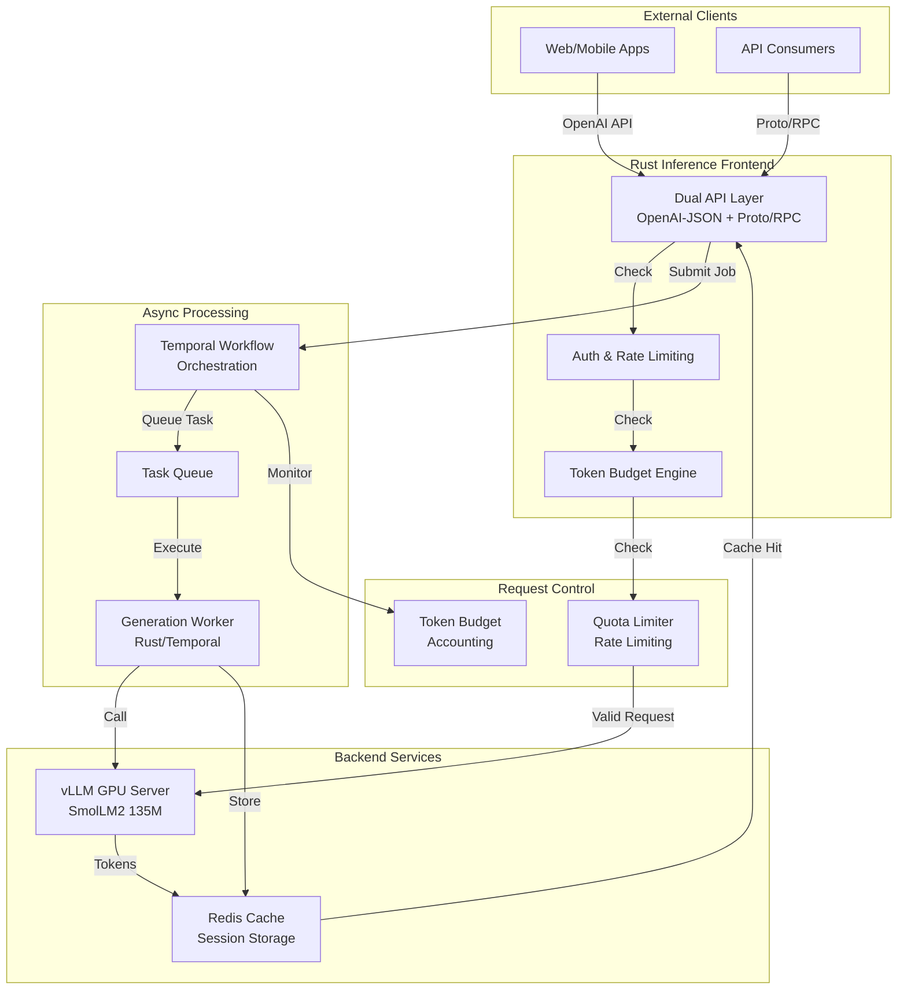
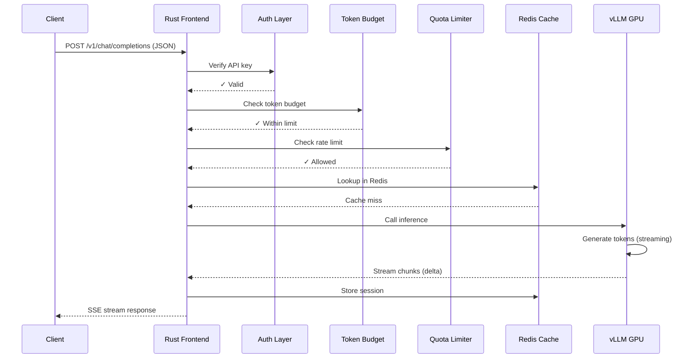
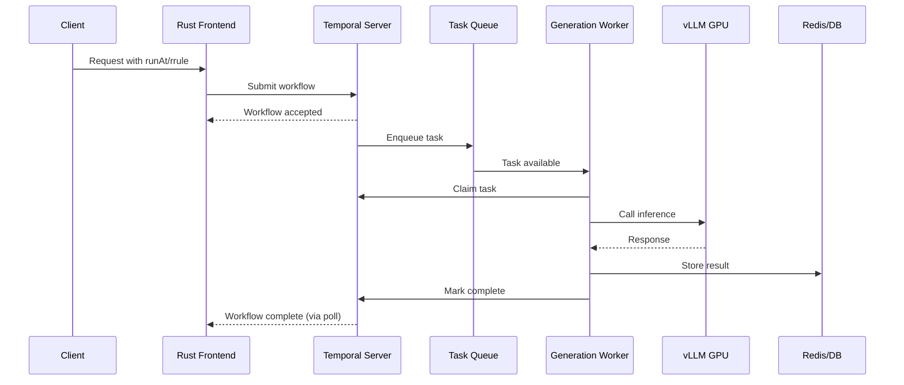
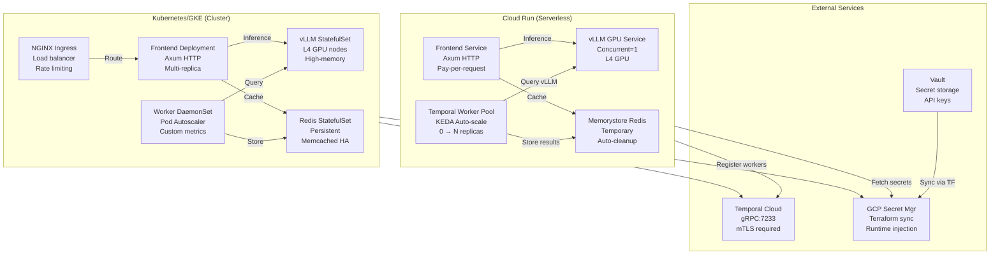

# Kubernetes Rust vLLM Inference Service - Architecture & Design

## Overview

**inference-data-plane** is a production-ready Rust-based inference service designed for high-performance, cost-efficient LLM serving on Kubernetes and Cloud Run. It provides a unified gateway for vLLM with async job processing, token budgeting, and quota enforcement.

**Repository:** https://github.com/anmho/inference-data-plane

---

## System Architecture

### Architecture Diagram



### Core Components

#### 1. **Rust Inference Frontend** (`rust-inference-frontdoor`)
- **Purpose:** HTTP/gRPC gateway for vLLM inference requests
- **API Layer:** Dual protocol support:
  - **OpenAI-compatible JSON/HTTP** for external clients (`/v1/chat/completions` style)
  - **Proto/RPC** for internal service-to-service communication (`application/connect+proto`)
- **Features:**
  - API key authentication & quota checking
  - Token budget enforcement (pre-request validation)
  - Request/response streaming
  - Redis-backed session caching
  - Graceful error handling with structured logging

#### 2. **Generation Worker** (`generation-worker`)
- **Purpose:** Async inference job processing via Temporal workflows
- **Components:**
  - **Temporal Worker** (`src/bin/temporal_worker.rs`): Executes inference tasks from queue
  - **Local Valkey Worker** (`src/main.rs`): Redis stream consumer for local testing
  - **Features:**
    - mTLS support for Temporal (gRPC + TLS)
    - Wake-from-zero autoscaling via KEDA
    - Async job queue for batch processing
    - Temporal workflow integration

#### 3. **Token Budget Engine** (`token-budget-engine`)
- **Purpose:** Token accounting and budget enforcement
- **Capabilities:**
  - Approximate token counting (via ml-tokenizers)
  - Budget policy enforcement (StrictReject, TrialReject)
  - Per-minute token rate limits
  - Prompt/completion token tracking
  - Test fixtures for validation

#### 4. **Generation Quota Limiter** (`generation-quota-limiter`)
- **Purpose:** Rate limiting and quota management
- **Features:**
  - In-memory quota tracking
  - Requests-per-minute limits
  - Token-per-minute budgeting
  - Concurrent quota checks

#### 5. **Control Plane** (`inference-control-plane`)
- **Purpose:** Orchestration and lifecycle management
- **Responsibilities:**
  - Job scheduling
  - Resource allocation
  - Health monitoring
  - Policy enforcement

---

## Data Flow

### Request Path (Streaming)



### Async Path (Temporal Workers)



---

## Deployment Targets

### Deployment Architecture



### Cloud Run (Serverless)
- **Components:**
  - `frontend-service.yaml` - Rust frontend service
  - `temporal-worker-pool.yaml` - KEDA-managed worker pool (scales 0→N)
  - `vllm-gpu-service.yaml` - vLLM GPU backend
  - `crema-scaledobject.yaml` - KEDA scaler configuration

- **Features:**
  - Wake-from-zero autoscaling
  - Direct VPC egress
  - Temporary Memorystore (Redis) for benchmarks
  - No idle cost when not in use

### Kubernetes (GKE)
- **Manifests:**
  - Base configs: `k8s/base/` (frontend, workers, configmaps)
  - Overlays: `k8s/overlays/gke/` (low-cost resources)
  - GPU support: `k8s/overlays/gke-vllm/` (L4 GPU tolerations)

- **Features:**
  - Kustomize-based configuration management
  - Multi-environment support
  - Resource quota limits
  - GPU node affinity

---

## Token Budget & Quota System

```mermaid
graph LR
    subgraph Input["Input"]
        Req["Incoming Request<br/>with Prompt"]
    end
    
    subgraph TokenBudget["Token Budget Engine"]
        Tokenize["Tokenize Prompt<br/>ml-tokenizers"]
        EstimatePrompt["Estimate Prompt<br/>Token Count"]
        PolicyCheck["Check Policy<br/>StrictReject|TrialReject"]
        RateCheck["Check Rate Limit<br/>tokens/min"]
    end
    
    subgraph QuotaSystem["Quota Limiter"]
        RPMCheck["Check Requests/min<br/>In-memory counter"]
        TokenBudgetCheck["Check Token Budget<br/>Accounting"]
        Reserve["Reserve quota<br/>for response"]
    end
    
    subgraph Decision["Decision"]
        Accept["✓ Accept Request<br/>Execute inference"]
        Reject["✗ Reject Request<br/>Return error"]
    end
    
    subgraph Tracking["Tracking"]
        CompletionTokens["Track Completion<br/>Tokens Generated"]
        UpdateMetrics["Update Usage<br/>Metrics"]
        ReleaseQuota["Release unused<br/>quota"]
    end
    
    Req -->|Prompt| Tokenize
    Tokenize -->|Token count| EstimatePrompt
    EstimatePrompt -->|Budget OK?| PolicyCheck
    PolicyCheck -->|Valid| RateCheck
    RateCheck -->|Within RPM?| RPMCheck
    RPMCheck -->|Quota available| TokenBudgetCheck
    TokenBudgetCheck -->|Reserve tokens| Reserve
    Reserve -->|OK| Accept
    PolicyCheck -->|Exceeds policy| Reject
    RateCheck -->|Rate limit hit| Reject
    RPMCheck -->|Too many requests| Reject
    TokenBudgetCheck -->|Insufficient quota| Reject
    
    Accept -->|Inference| CompletionTokens
    CompletionTokens -->|Token count| UpdateMetrics
    UpdateMetrics -->|Finalize| ReleaseQuota
```



## Model & Configuration

### Supported Models
- **Default:** HuggingFaceTB/SmolLM2-135M-Instruct
- **Backend:** vLLM 0.6.6 (OpenAI-compatible)

### Configuration

#### Environment Variables (Frontend)
```bash
MODEL_ID=HuggingFaceTB/SmolLM2-135M-Instruct
MODEL_CONTEXT_LIMIT=8192
MODEL_DEFAULT_MAX_TOKENS=256
MODEL_MAX_OUTPUT_TOKENS=1024

REDIS_URL=redis://localhost:6379
API_KEYS_SECRET=inference-api-keys (or direct comma-separated keys)
FRONTEND_ALLOW_UNAUTH=false  # Set true for public Cloud Run access
```

#### Environment Variables (Temporal Worker)
```bash
TEMPORAL_ENABLED=true
TEMPORAL_ADDRESS=temporal-grpc.anmho.com:7233
TEMPORAL_NAMESPACE=default
TEMPORAL_TASK_QUEUE=inference-gpu
TEMPORAL_API_KEY_SECRET=temporal-api-key  # From GCP Secret Manager
TEMPORAL_TLS_CA_CERT_SECRET=temporal-ca-cert
TEMPORAL_TLS_CERT_SECRET=temporal-cert
TEMPORAL_TLS_KEY_SECRET=temporal-key
```

---

## Protocol & API Design

### OpenAI-Compatible API (External)
```json
POST /v1/chat/completions
Content-Type: application/json

{
  "model": "HuggingFaceTB/SmolLM2-135M-Instruct",
  "messages": [
    {"role": "system", "content": "You are helpful."},
    {"role": "user", "content": "Hello"}
  ],
  "max_tokens": 256,
  "temperature": 0.7,
  "stream": true
}
```

### Internal Proto/RPC API (Service-to-Service)
```protobuf
service InferenceService {
  rpc Generate(GenerateRequest) returns (GenerateResponse);
  rpc StreamGenerate(GenerateRequest) returns (stream GenerateChunk);
}

message GenerateRequest {
  string model = 1;
  repeated ChatMessage messages = 2;
  string prompt = 3;
  uint64 max_tokens = 4;
  float temperature = 5;
}

message GenerateChunk {
  string request_id = 1;
  string model = 2;
  string delta = 3;
  uint64 generated_tokens = 4;
  string finish_reason = 5;
}
```

---

## Deployment Flow

### Prerequisites
1. GCP project (`anmho-infra-prod`) with:
   - Cloud Run API enabled
   - Artifact Registry (Docker repository)
   - VPC with subnets
   - Service accounts with appropriate IAM roles

2. Temporal cluster with:
   - gRPC endpoint (e.g., `temporal-grpc.anmho.com:7233`)
   - API key or mTLS certificates
   - Task queue configured

3. Vault with Temporal credentials at:
   - `secret/temporal/api-key`
   - Or mTLS certificates path

### Deployment Steps

#### 1. Build & Push Images
```bash
cd /path/to/inference-data-plane
RUN_BUILD=true make cloudrun-bench-once
```

#### 2. Deploy vLLM GPU Backend
```bash
./scripts/cloudrun-gpu-deploy.sh
```

#### 3. Set Temporal Secret
```bash
TEMPORAL_API_KEY="$(vault kv get -field=value secret/temporal/api-key)"
gcloud secrets create temporal-api-key \
  --project anmho-infra-prod \
  --replication-policy automatic \
  --data-file=<(echo -n "$TEMPORAL_API_KEY")
```

#### 4. Deploy Frontend & Worker
```bash
TEMPORAL_API_KEY_SECRET=temporal-api-key make cloudrun-bench-once
```

#### 5. Run Benchmarks
```bash
# Included in bench-once:
# - Smoke tests (connect_smoke)
# - k6 load tests
# - Auto-cleanup
```

---

## Monitoring & Observability

### Metrics
- Requests per minute (frontend)
- Token rate limiting (quota limiter)
- Prompt & generated token counts (token budget engine)
- Workflow execution metrics (Temporal)
- vLLM inference latency

### Logging
- Structured JSON logging (tracing-subscriber)
- Request IDs for tracing
- Budget rejection reasons
- Temporal workflow status

### Health Checks
```bash
GET /healthz  # Frontend health
GET /readyz   # Readiness probe
```

---

## Performance Characteristics

### Latency
- **First token:** ~50-200ms (vLLM GPU inference)
- **Streaming:** Continuous delta chunks
- **Token budget check:** <1ms (in-memory)
- **Quota check:** <1ms (in-memory)

### Throughput
- **Concurrent requests:** Limited by vLLM batch size + quota
- **Token/min:** Configurable per quota policy
- **Scaling:** KEDA auto-scales workers based on queue depth

### Cost
- **Cloud Run:** Pay-per-request + CPU/memory
- **vLLM GPU:** L4 node (on-demand or spot)
- **Redis:** Temporary Memorystore during benchmarks (auto-cleanup)
- **Idle cost:** Zero (no running services)

---

## Testing & Benchmarking

### Local Testing
```bash
# Start all services (vLLM, Redis, Frontend)
./scripts/start.sh

# Run smoke tests
cargo run -q -p inference-frontend --bin connect_smoke

# Load testing (k6)
./scripts/load.sh
```

### Cloud Run Benchmarking
```bash
# One-shot benchmark (deploy → test → cleanup)
TEMPORAL_API_KEY_SECRET=temporal-api-key make cloudrun-bench-once

# Or step-by-step:
./scripts/cloudrun-gpu-deploy.sh
./scripts/cloudrun-deploy.sh
./scripts/crema-deploy.sh
./scripts/load.sh
./scripts/cloudrun-cleanup.sh
```

### Idle Verification
```bash
# Verify no leftover paid resources
make cloudrun-verify-idle
```

---

## Crates & Dependencies

### Workspace Structure
```
inference-data-plane/
├── crates/
│   ├── rust-inference-frontdoor/  # HTTP gateway (Axum)
│   ├── generation-worker/          # Temporal async worker
│   ├── token-budget-engine/        # Token budgeting lib
│   ├── generation-quota-limiter/   # Rate limiting lib
│   ├── inference-control-plane/    # Orchestration lib
│   └── gpu-idler/                  # GPU utility
├── proto/                          # Protobuf definitions
├── k8s/                            # Kubernetes manifests
├── cloudrun/                       # Cloud Run configs
├── scripts/                        # Deployment automation
└── Cargo.toml                      # Workspace root
```

### Key Dependencies
- **Web:** Axum 0.8, Tower-HTTP 0.6
- **Async:** Tokio 1.x, Futures 0.3
- **gRPC:** Temporalio SDK 0.4.0, Tonic
- **Serialization:** Serde, Prost
- **Storage:** Redis 0.32 (async)
- **Observability:** Tracing, Tracing-Subscriber

---

## Next Steps & Roadmap

### Immediate
- [ ] Add Terraform integration to `projects/inference/` for Vault secret syncing
- [ ] Wire up terraform-managed GCP secrets
- [ ] Set Temporal API key in anmho-infra-prod

### Short Term
- [ ] Integrate with `codex/inference-gke-atlantis` terraform branch
- [ ] Publish separate library crates (token-budget-engine, quota-limiter)
- [ ] Add more model support beyond SmolLM2

### Future
- [ ] GPU idling optimization
- [ ] Multi-tenant isolation
- [ ] Advanced monitoring dashboard
- [ ] Model fine-tuning integration

---

## References

- **GitHub:** https://github.com/anmho/inference-data-plane
- **Terraform (Kubernetes Infra):** https://github.com/anmho/terraform/tree/codex/inference-gke-atlantis
- **vLLM:** https://github.com/vllm-project/vllm
- **Temporal:** https://temporal.io
- **Cloud Run:** https://cloud.google.com/run
