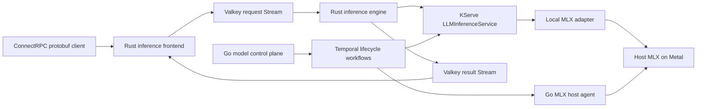

# Inference Platform Architecture

## Boundaries

The serving path is Rust. Model registration and lifecycle orchestration are Go and remain outside token generation.

## Request Path

`inference-frontend` authenticates requests, computes token budgets, reserves quota, resolves the model, and publishes a versioned protobuf job. It exposes protobuf ConnectRPC methods over HTTP/2:

- `Generate`
- `StreamGenerate`
- `SubscribeGeneration`

`inference-engine` uses a Valkey consumer group to claim jobs. It calls the stable KServe model endpoint, publishes ordered token events, writes a terminal event, reconciles quota, and only then acknowledges the job.

Inbound work uses `XREADGROUP`, `XACK`, `XPENDING`, and `XAUTOCLAIM`. Outbound results use independent `XREAD` cursors. Result subscribers never acknowledge tokens and cannot consume another subscriber's events.

Completed result Streams remain replayable for ten minutes. A disconnected client can resume strictly after its last event ID; disconnecting does not stop generation.

## Valkey Connections

`inference-streams` owns stream keys, protobuf encoding, leases, deduplication, recovery, retention, and quota scripts.

- `fred` owns automatically pipelined publication.
- Dedicated `redis-rs` connections own blocking `XREAD` and `XREADGROUP` calls.
- A multiplexed `redis-rs` manager owns metadata and Lua operations.

RDMA is deferred because the current path runs on macOS/Minikube or managed RESP services, and no mature Rust Valkey RDMA transport exists for those environments.

## Model Lifecycle

KServe 0.18 `LLMInferenceServiceConfig` declarations in `models/` are the supported-model source of truth. The Go ConnectRPC control plane lists, resolves, loads, drains, and unloads those models.

Temporal runs workflows only for model state transitions. It does not run a workflow per request or token. The MLX host agent accepts only catalogued model IDs, starts fixed commands, tracks child processes it owns, and refuses to kill unowned processes.

For local Apple Silicon:

- Model: `mlx-community/SmolLM2-135M-Instruct`
- Runtime: MLX/Metal on the host
- Kubernetes endpoint: KServe-managed adapter to `host.minikube.internal`

The adapter remains live while MLX is stopped, but its readiness follows the real MLX `/health` endpoint. Temporal probes the stable KServe endpoint before completing model load.

## Deployment Boundary

The supported runnable target is the dedicated local Minikube profile `inference`. Local Valkey and Temporal use `emptyDir`; there are no PVCs or public load balancers.

Cloud infrastructure is declared in the separate Terraform repository under `projects/inference`. Terraform does not deploy application workloads. Public cloud serving, distributed KV transfer, priority scheduling, credit eviction, and GPU placement are deferred.

Detailed decisions and rejected alternatives are recorded in `docs/decisions/`.
