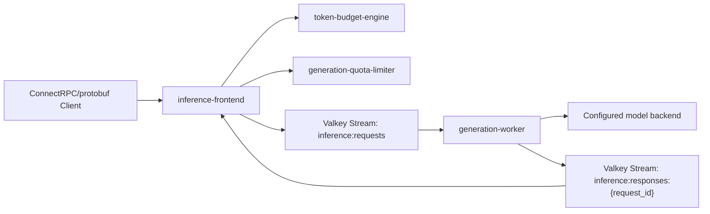
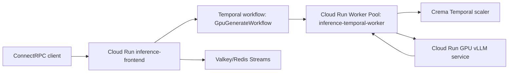

# Inference Data Plane

Rust services and libraries for the request path of LLM serving: prompt token budgeting, context-window admission, quota reservations, Valkey-backed work queues, generated-token streaming, and cancellation-aware reconciliation.

This is designed as a portfolio project for AI infrastructure, backend platform, and storage/platform roles. It emphasizes the request path around model serving rather than model quality.

## Architecture



## Crates

- `inference-frontend`: ConnectRPC/protobuf service exposing unary `Generate` and server-streaming `StreamGenerate`, enforcing auth, token budgets, generation limits, and quota reservations before enqueueing generation work into Valkey Streams.
- `generation-worker`: Worker service that consumes Valkey generation jobs, calls the configured synthetic, MLX/OpenAI-compatible, or vLLM/OpenAI-compatible backend, and writes chunks plus terminal token counts to per-request Valkey response streams.
- `token-budget-engine`: Pure Rust library and `budget` CLI for prompt token estimation, context-window admission, and truncation policy experiments.
- `generation-quota-limiter`: In-memory quota limiter with reservation, refund, and cancellation semantics. It is intentionally shaped so a Valkey backend can replace the local counter store.

## Quickstart

The primary config surface is YAML, not per-setting environment variables:

- `config/local.yaml`: default local path with a real MLX/Metal model.
- `config/synthetic.yaml`: synthetic backend for isolating data-plane overhead.

`CONFIG_FILE` only points the services/scripts at a config document. Docker and Kubernetes still override network addresses where the same service needs a different in-cluster hostname.

Run tests:

```bash
make test
```

Start the real local model and the Rust/Valkey stack:

```bash
make start
```

The default model is:

```text
mlx-community/SmolLM2-135M-Instruct
```

Show a unary request and the token stream:

```bash
make stream
```

Run the k6 Connect/protobuf load test:

```bash
make bench
```

Use the synthetic backend for data-plane-only load testing:

```bash
CONFIG_FILE=./config/synthetic.yaml make start
CONFIG_FILE=./config/synthetic.yaml make bench
```

If you want to start just the MLX model server:

```bash
make model-start
```

Run the end-to-end checks:

```bash
./scripts/e2e.sh
```

Deploy to minikube:

```bash
./scripts/minikube-deploy.sh
kubens inference-data-plane
kubectl port-forward svc/inference-frontend 8080:8080
BASE_URL=http://localhost:8080 ./scripts/e2e.sh
```

Or apply the local Kubernetes layer through Terraform local state:

```bash
terraform -chdir=infra/local init
terraform -chdir=infra/local apply
kubens inference-data-plane
kubectl port-forward svc/inference-frontend 8080:8080
BASE_URL=http://localhost:8080 ./scripts/e2e.sh
```

## Low-Cost GKE App Deployment

The GKE infrastructure is declared in the existing private Terraform repo
`anmho/terraform` under `projects/inference`. This Rust repo only owns app
image build, Kubernetes manifests, deployment, and load testing.

Cost guardrails:

- zonal GKE Standard cluster, so the GKE free-tier management credit can apply
- zero CPU nodes when idle; app pods can trigger one `e2-small` Spot node through cluster autoscaling
- existing global GCP `default` VPC plus regional `default` subnet in `us-central1`
- no new VPC
- no Cloud NAT
- no public LoadBalancer
- GPU node pool defaults to zero and is only used by the opt-in vLLM path
- no app PVCs

The GKE deployment overlay uses the synthetic backend by default because the
Mac-hosted MLX server is not reachable from GKE:

```bash
make gke-auth
make gke-build-push
make gke-deploy
make gke-forward
BASE_URL=http://localhost:8080 make gke-bench
```

The real GKE model path uses vLLM on an opt-in GPU node:

```bash
make gke-build-push
make gke-vllm-deploy
make gke-vllm-bench
```

That path uses `HuggingFaceTB/SmolLM2-135M-Instruct`. The local Mac path remains
`mlx-community/SmolLM2-135M-Instruct` through MLX/Metal.

## Serverless Cloud Run GPU Path

The preferred cloud GPU path is Cloud Run GPU, not always-on GKE nodes. Cloud
Run now supports one NVIDIA GPU per instance, including `nvidia-l4` and
`nvidia-rtx-pro-6000`, with scale-to-zero. For this demo the default is L4
because `HuggingFaceTB/SmolLM2-135M-Instruct` is tiny and does not need a larger
GPU.

The serverless shape is:



Cloud Run artifacts live in `cloudrun/`:

- `frontend-service.yaml`: Rust ConnectRPC frontend on Cloud Run, min scale 0.
- `temporal-worker-pool.yaml`: Temporal worker pool, min scale 0, CPU
  always allocated so the poll loop can run when Crema scales it up.
- `crema-scaledobject.yaml`: Crema/KEDA-style Temporal task queue scaler config.
- `vllm-gpu-service.yaml`: Cloud Run GPU vLLM service using L4, 4 CPU, 16Gi,
  max instance 1, min scale 0, no GPU zonal redundancy for lower cost.

Deploy the GPU model service:

```bash
make cloudrun-gpu-deploy
```

Deploy the frontend and worker pool after provisioning a managed RESP broker
and Temporal credentials in Secret Manager:

```bash
export TEMPORAL_API_KEY_SECRET=temporal-api-key
make cloudrun-deploy
make cloudrun-crema-deploy
```

For a temporary end-to-end benchmark, create the smallest benchmark
Memorystore Valkey instance, deploy the Cloud Run GPU service, deploy the Rust
frontend and Temporal worker pool, deploy Crema, run a ConnectRPC smoke request
and k6, then clean everything up:

```bash
export TEMPORAL_API_KEY_SECRET=temporal-api-key
make cloudrun-bench-once
```

Set `RUN_BUILD=true` to rebuild and push images first. The benchmark wrapper
uses two temporary subnets: `inference-bench-egress` for Cloud Run Direct VPC
egress and `inference-bench-psc` for Memorystore Private Service Connect.
It refuses to start without the Temporal API key secret because Crema needs
that credential to observe Temporal backlog and wake the worker pool from zero.
The wrapper temporarily grants public Cloud Run invocation on the frontend so a
local k6/client run can hit the remote URL; cleanup deletes the frontend after
the run.
It also creates a temporary `inference-api-keys` Secret Manager secret when
`API_KEYS_SECRET` is not supplied, so the remote benchmark does not use the
local `dev-key`.

To keep the deployed resources around for inspection instead of deleting them
after the run:

```bash
export TEMPORAL_API_KEY_SECRET=temporal-api-key
CLEANUP_AFTER=false make cloudrun-bench-once
```

The Rust frontend and Rust worker also support mTLS with:

```bash
export TEMPORAL_TLS_CA_CERT_SECRET=temporal-ca-cert
export TEMPORAL_TLS_CERT_SECRET=temporal-client-cert
export TEMPORAL_TLS_KEY_SECRET=temporal-client-key
```

Crema scaling in this scaffold currently uses KEDA Temporal `apiKeyFromEnv`, so
`make cloudrun-crema-deploy` requires `TEMPORAL_API_KEY_SECRET`. Without
Temporal credentials the scripts fail before deploying partial Cloud Run
resources.

Disable the GPU attachment and keep the service at min scale zero:

```bash
make cloudrun-gpu-disable
```

Clean up the serverless benchmark resources and verify no temporary serving
capacity remains:

```bash
make cloudrun-cleanup
make cloudrun-verify-idle
```

The Rust lifecycle contract is in `crates/inference-control-plane`. It defines
the Temporal workflow/activity names and a testable GPU session state machine:

- `GpuGenerateWorkflow`
- `GpuStreamGenerateWorkflow`
- `AdmitRequest`
- `EnsureCloudRunGpuEndpoint`
- `GenerateWithCloudRunGpu`
- `ReconcileQuota`
- `ReleaseIdleCloudRunGpu`

The serverless path uses Temporal as the source of truth for lifecycle, timeout,
cancellation, quota reconciliation, and GPU release. Crema scales the Cloud Run
worker pool from zero from Temporal backlog and caps it at one worker. With an
empty task queue, the worker pool should scale back to zero.

For a cost-capped smoke run, use the one-shot target. It deploys, runs a single
ConnectRPC smoke generation, waits one second, and scales this app's deployments
back to zero even if the smoke request fails:

```bash
make gke-smoke-once
```

The GKE vLLM overlay is benchmark-only. It does not install an idle controller.
Use `make gke-shutdown` or the cleanup trap in `make gke-vllm-bench` to scale
the Kubernetes workloads back to zero. The production-shaped path is Cloud Run
GPU plus Temporal plus Crema:

```yaml
cloudrun/temporal-worker-pool.yaml:
  autoscaling.knative.dev/minScale: "0"
  autoscaling.knative.dev/maxScale: "1"

cloudrun/crema-scaledobject.yaml:
  minReplicaCount: 0
  maxReplicaCount: 1
  triggers:
    - type: temporal
```

This still bills for node startup, image pull, model load, drain, and VM deletion
time. The one-second setting is the idle decision threshold, not the total
billable GPU lifetime. Cluster autoscaler can only remove a node after no
remaining pods require it.

The real local model path uses MLX/Metal on Apple Silicon:

```text
mlx-community/SmolLM2-135M-Instruct
```

That MLX artifact is not a GKE/NVIDIA GPU runtime. A real GKE GPU path should be
a separate vLLM deployment using the corresponding Hugging Face/PyTorch model,
for example `HuggingFaceTB/SmolLM2-135M-Instruct`, on an explicitly enabled GPU
node pool that defaults to zero nodes.

## Example Requests

Run the binary protobuf smoke client:

```bash
make stream
```

The frontend exposes:

- `inference.v1.InferenceService/Generate`: unary protobuf request and protobuf response.
- `inference.v1.InferenceService/StreamGenerate`: unary protobuf request and Connect server-streaming protobuf chunks.

Budget CLI:

```bash
cargo run -p token-budget-engine --bin budget -- \
  crates/token-budget-engine/fixtures/chat.json \
  --model local-vllm \
  --max-tokens 512 \
  --policy truncate-oldest
```

## What This Demonstrates

- Rust async services with `axum`, `tokio`, `prost`, `reqwest`, and structured tracing.
- ConnectRPC-style protobuf transport for unary and unidirectional token streaming.
- Real local model serving through MLX/Metal on Apple Silicon for the default local path.
- Inference-specific admission control: prompt tokens, reserved output tokens, and context-window enforcement.
- Data-plane decoupling through a separate worker process, with Valkey Streams consumer groups as the middleman between admission and generation.
- Quota accounting that reserves estimated generation tokens before inference and refunds unused budget after completion or cancellation.
- Platform concerns that map to production AI systems: backpressure, request rejection before expensive work, observability, and replaceable storage backends.

## Current Tradeoffs

- Token counting uses a deterministic approximation instead of a model tokenizer. The `token-budget-engine` API is built around a `TokenCounter` trait so a Hugging Face tokenizer can be plugged in later.
- Streaming generated token counts are produced by the worker and returned through the Valkey response stream.
- The frontend exposes ConnectRPC/protobuf. The frontend enqueues jobs with `XADD`, logs the returned request stream entry ID, and workers consume with `XREADGROUP` plus `XACK` after writing terminal response events.
- The frontend computes a stable prompt-prefix `cache_key` and sends cache metadata in the Valkey job. This is cache observability and future routing input; true cross-worker KV reuse still needs vLLM/LMCache-aware routing.
- Serverless worker lifecycle is handled by Temporal backlog through Crema. The worker pool scales from zero and is capped at one worker.
- The Kubernetes demo intentionally runs one frontend and one worker. Scaling workers correctly needs Valkey consumer groups; scaling frontends correctly needs Valkey-backed quota counters.
- Kubernetes no longer deploys a self-hosted Valkey. Cloud deployments should use a managed RESP-compatible broker secret.
- The default local model is `mlx-community/SmolLM2-135M-Instruct` served by `mlx_lm.server` on the Mac host. The worker also keeps a synthetic backend for isolating data-plane overhead during stress tests.
- The primary cloud GPU target is Cloud Run GPU with Temporal and Crema. GKE GPU
  remains a fallback benchmark environment, not the default serving posture.

The Rust dependency is still named `redis` because that is the standard RESP client crate. The deployed broker in this scaffold is Valkey.

## Test Plan

```bash
make fmt
make lint
make test
make budget
```

Manual checks:

- Oversized prompts return `400` before hitting vLLM.
- Invalid or missing API keys return `401`/`403`.
- Over-quota requests return `429`.
- Non-streaming completions reconcile quota with actual completion tokens when available.
- Streaming completions use Connect/protobuf chunks and reconcile quota when the stream ends.
