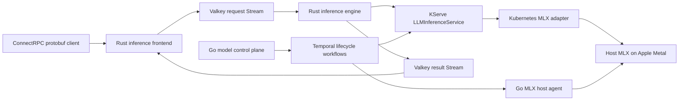

# Inference Platform

Local-first LLM serving platform with a Rust request path and a Go model-lifecycle control plane.



## Request Path

- `inference-frontend` authenticates, budgets tokens, reserves quota, resolves the configured model, and publishes a protobuf job.
- `inference-engine` consumes jobs with `XREADGROUP`, calls an OpenAI-compatible MLX/vLLM endpoint, writes protobuf events, reconciles quota, and then `XACK`s the job.
- `inference-streams` owns versioned stream keys, leases, stale-job recovery, result retention, quota scripts, and reconnecting cursors.
- Result subscribers use independent `XREAD` cursors. They never acknowledge token chunks and never consume another subscriber's events.

Public ConnectRPC methods:

- `Generate`: run a request and return the complete response.
- `StreamGenerate`: start a request and stream `GenerationEvent` messages.
- `SubscribeGeneration`: replay from `0-0`, or resume strictly after `after_event_id`, and then continue live.

Completed result Streams expire after 10 minutes. Client disconnection does not cancel generation.

## Length, Batching, and Termination

These are separate limits with different owners:

- The frontend applies `prompt_tokens + max_tokens <= context_limit` before publishing a job. `max_tokens` is the per-request output budget; it is not a batch-size setting.
- The engine forwards `max_tokens` and optional `stop` strings to the model runtime. The new `stop` field supports markers such as `[END]`; EOS and stop-token handling remain runtime responsibilities. vLLM documents `max_tokens`, `stop`, `stop_token_ids`, and EOS behavior in its [SamplingParams API](https://docs.vllm.ai/en/latest/api/vllm/).
- A runtime's model-length ceiling is separate from the request budget. The GKE vLLM deployment pins `--max-model-len 4096`; vLLM documents that engine arguments control online serving and that `--max-num-seqs` and `--max-num-batched-tokens` shape scheduler capacity, not an individual response's length ([engine arguments](https://docs.vllm.ai/en/stable/configuration/engine_args/)).
- vLLM provides continuous batching inside the model server. This repository's current engine consumes one job at a time per process, so the local benchmark does not claim to measure continuous-batching throughput. Increasing engine concurrency is a separate performance milestone because it changes fairness, cancellation, and quota behavior.
- A model stop condition becomes a `GenerationCompleted` result with `finish_reason`; the frontend then emits one terminal `GenerationEvent`. `[END]` is not stored as a fake Redis control message and terminal events are not inferred from client disconnects.

See the component contracts in [inference-frontend](crates/inference-frontend/README.md), [inference-engine](crates/inference-engine/README.md), and [token-budget-engine](crates/token-budget-engine/README.md).

## Control Plane

The Go control plane is outside the token hot path:

- Git-managed KServe `LLMInferenceServiceConfig` resources are the model catalog.
- ConnectRPC exposes list, resolve, load, drain, unload, and status methods.
- Temporal runs model load/readiness/drain/unload workflows only. It does not run one workflow per inference request or token.
- The MLX host agent accepts only catalogued model IDs and fixed launch settings, and stops only processes it owns.

Local model: `mlx-community/SmolLM2-135M-Instruct` on MLX/Metal.

NVIDIA model identity: `HuggingFaceTB/SmolLM2-135M-Instruct` for vLLM.

## Valkey Client

The broker is Valkey. The URI is still written as `redis://` because that is the standard RESP URI scheme understood by client libraries; it does not select a Redis server.

- `fred` 10 provides the cloneable, automatically pipelined hot path for `XADD` publication.
- `redis-rs` provides dedicated blocking connections for `XREAD`, `XREADGROUP`, and `XAUTOCLAIM`, plus Lua-backed quota/lease operations.
- Blocking reads never share the auto-pipelined connection, so a blocked read cannot stall unrelated commands.
- RDMA is not enabled. Valkey's RDMA transport is experimental, Linux/hardware specific, and unavailable on Apple Metal, ordinary Minikube networking, and managed Valkey services.

See [docs/decisions](docs/decisions) for the decision records and rejected alternatives.

## Run

Prerequisites: Docker Desktop, Minikube, `kubectl`, `kubectx`, `kubens`, Go, Rust, `mlx_lm.server`, `jq`, and `curl`.

Run the complete real-model demo:

```bash
make start
```

That command creates or reuses a dedicated `inference` Minikube profile with Kubernetes 1.34, installs pinned KServe 0.18 dependencies without a public load balancer, starts the MLX host agent, loads the model through Temporal, streams a response, replays the retained result, and stops the host-owned model process.

Run the same lifecycle followed by k6:

```bash
make bench
```

Run the Valkey integration suite against an ephemeral Valkey 9.1 container:

```bash
make valkey-test
```

Run language tests and linters:

```bash
make test
make lint
```

For an already-running frontend, show live token output and replay:

```bash
BASE_URL=http://127.0.0.1:8080 make stream
```

## Kubernetes Boundaries

The local overlay contains ephemeral Valkey and Temporal Deployments. It creates no PVC and no `LoadBalancer` Service. The KServe model disables its storage initializer because weights live in host MLX, not Kubernetes.

Cloud Terraform lives in the separate `anmho/terraform` repository under `projects/inference`. It uses Atlantis, keeps GKE disabled by default, and synchronizes Temporal mTLS fields from Vault into purpose-specific Secret Manager secrets with ephemeral reads and write-only values. Terraform does not deploy application workloads.

## Scope

Implemented now: admission, quota reservation/refund, retry leases, replayable token Streams, local MLX execution, KServe model declarations, and Temporal model lifecycle.

Deferred: distributed KV transfer, LMCache, cache-aware multi-replica routing, priority preemption, credit scheduling, GPU placement, and public cloud serving.
